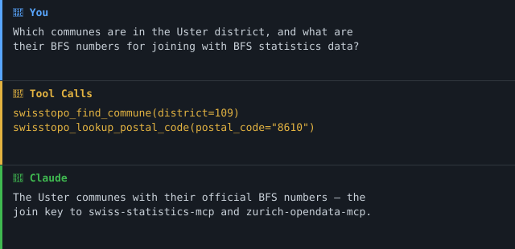

> 🇨🇭 **Teil des [Swiss Public Data MCP Portfolios](https://github.com/malkreide)**

# 🗺️ swisstopo-mcp


[](https://opensource.org/licenses/MIT)
[](https://www.python.org/downloads/)
[](https://modelcontextprotocol.io/)
[](https://github.com/malkreide/swisstopo-mcp)


> MCP-Server fuer schweizerische Bundesgeodaten -- Karten, Hoehenmodelle, Geocodierung, Katasterauszuege und herunterladbare Datensaetze via Swisstopo-APIs

[🇬🇧 English Version](README.md)

---

## Uebersicht

`swisstopo-mcp` gibt KI-Assistenten Zugriff auf die offizielle schweizerische Geodateninfrastruktur ueber 20 Tools, alle ohne Authentifizierung:

| Quelle | Daten | API |
|--------|-------|-----|
| **Swisstopo REST API** | 500+ Geodaten-Layer (Gebaeude, Grenzen, Landnutzung) | REST/JSON |
| **Geocoding** | Amtliche Adressen, Ortsnamen, PLZ | REST/JSON |
| **Hoehenservice** | Hoehe ueber Meer, Hoehenprofile | REST/JSON |
| **STAC-Katalog** | Orthophotos, Hoehenmodelle, 3D-Gebaeude | STAC 0.9 |
| **WMTS** | Landeskarten, Luftbilder, Bauzonen | URL-Builder |
| **OEREB-Kataster** | Eigentumsbeschraenkungen, Grundstuecke | REST/JSON (kantonal) |
| **geodienste.ch** | Interkantonale Basisgeodaten (amtliche Vermessung, belastete Standorte, Gefahrenkarten, …) | OGC API Features / WMS / WFS |
| **OpenStreetMap** | Points of Interest (Schulen, Spielplaetze, Apotheken, …) | Overpass API (ODbL) |
| **OpenPLZ API** | Administrative Adressebene: PLZ → Gemeinde (**BFS-Nummer**) → Bezirk → Kanton | REST/JSON (BFS + swisstopo OGD) |

**Anker-Demo-Abfrage:** *«Welche Gemeinden liegen im Bezirk Uster, und wie lauten ihre BFS-Nummern fuer die Verknuepfung mit BFS-Statistikdaten?»*
(Die BFS-Gemeindenummer ist der amtliche Join-Schluessel zu [`swiss-statistics-mcp`](https://github.com/malkreide) und [`zurich-opendata-mcp`](https://github.com/malkreide/zurich-opendata-mcp) — damit wird aus dem Geodaten-Wrapper ein semantischer Konnektor auf Gemeindeebene.)
[→ Weitere Anwendungsbeispiele nach Zielgruppe →](EXAMPLES.md)

### Demo



---

## Funktionen

- 🗺️ **20 Tools** (REST, Geocoding, Hoehe, STAC, WMTS, OEREB, geodienste.ch, OpenStreetMap/Overpass, OpenPLZ)
- 🏛️ Administrative Adressebene aufloesen (PLZ → Gemeinde/**BFS-Nummer** → Bezirk → Kanton) via OpenPLZ
- 🔍 Schweizerische Adressen geocodieren und Koordinaten rueckwaerts geocodieren
- 🏔️ Hoehe ueber Meer abfragen und Hoehenprofile berechnen
- 📦 Geodatensaetze entdecken und herunterladen (Orthophotos, 3D-Gebaeude, historische Karten)
- 🏗️ Kartenobjekte an Koordinaten ueber 500+ Swisstopo-Layer identifizieren
- 🔗 Teilbare map.geo.admin.ch-Links generieren
- 📋 Grundstueck-IDs (EGRID) nachschlagen und OEREB-Auszuege abrufen
- 🔓 **Kein API-Schluessel erforderlich** fuer alle Tools (OEREB-Auszug benoetigt einen unterstuetzten Kanton)
- ☁️ **Dualer Transport** -- stdio (Claude Desktop) + Streamable HTTP (Cloud)

---

## Voraussetzungen

- Python 3.11+
- [uv](https://github.com/astral-sh/uv) (empfohlen) oder pip

---

## Installation

```bash
# Repository klonen
git clone https://github.com/malkreide/swisstopo-mcp.git
cd swisstopo-mcp

# Installieren
pip install -e .
# oder mit uv:
uv pip install -e .
```

Oder mit `uvx` (ohne dauerhafte Installation):

```bash
uvx swisstopo-mcp
```

---

## Schnellstart

```bash
# stdio (fuer Claude Desktop)
python -m swisstopo_mcp.server

# Streamable HTTP (Port 8000)
python -m swisstopo_mcp.server --http --port 8000
```

Sofort in Claude Desktop ausprobieren:

> *"Wo befindet sich die Bahnhofstrasse 1, Zuerich? Gib mir die Koordinaten."*
> *"Welche Hoehe hat der Uetliberg-Gipfel?"*
> *"Welche Gebaeude befinden sich bei den Koordinaten 2683500, 1247500 (LV95)?"*

---

## Konfiguration

### Claude Desktop

Editiere `~/Library/Application Support/Claude/claude_desktop_config.json` (macOS) bzw. `%APPDATA%\Claude\claude_desktop_config.json` (Windows):

```json
{
  "mcpServers": {
    "swisstopo": {
      "command": "python",
      "args": ["-m", "swisstopo_mcp.server"]
    }
  }
}
```

Oder mit `uvx`:

```json
{
  "mcpServers": {
    "swisstopo": {
      "command": "uvx",
      "args": ["swisstopo-mcp"]
    }
  }
}
```

**Pfad zur Konfigurationsdatei:**
- macOS: `~/Library/Application Support/Claude/claude_desktop_config.json`
- Windows: `%APPDATA%\Claude\claude_desktop_config.json`

### Cloud-Deployment (SSE fuer Browser-Zugriff)

Fuer den Einsatz via **claude.ai im Browser** (z.B. auf verwalteten Arbeitsplaetzen ohne lokale Software):

**Render.com (empfohlen):**
1. Repository auf GitHub pushen/forken
2. Auf [render.com](https://render.com): New Web Service -> GitHub-Repo verbinden
3. Start-Befehl setzen: `python -m swisstopo_mcp.server --http --port 8000`
4. In claude.ai unter Settings -> MCP Servers eintragen: `https://your-app.onrender.com/sse`

---

## Verfuegbare Tools

### REST API (Layer- & Feature-Abfragen)

| Tool | Beschreibung |
|------|-------------|
| `swisstopo_map_query` | Der nationale Kartenkatalog (api3.geo.admin.ch). Eine `operation` pro Aufruf — siehe die fuenf unten |
| `swisstopo_zoning_at` | Harmonisierte Bauzone an einer Koordinate — ein Aufruf, ohne Layer-Suche (nicht rechtsverbindlich) |
| `swisstopo_municipality_at` | Gemeinde, Kanton und amtliche BFS-Nummer an einer Koordinate |

#### Operationen von `swisstopo_map_query`

| `operation` | Beantwortet | Pflichtargumente |
|-------------|-------------|------------------|
| `search_layers` | Welche Layer gibt es zu einem Stichwort? (500+ Katalog) | `query` |
| `layer_info` | Welche Felder sind auf diesem Layer abfragbar, und wie sieht die Legende aus? | `layer` |
| `features_at_point` | Was liegt an dieser Koordinate? | `layers` + ein Punkt (`lat`/`lon` **oder** `easting`/`northing`) |
| `features_by_attribute` | Welche Features tragen diesen Wert? (z.B. Gebaeude nach EGID) | `layer`, `search_field`, `search_text` |
| `feature_by_id` | Gib mir dieses eine Feature vollstaendig, mit Geometrie | `layer`, `feature_id` |

Argumente, die zu einer anderen Operation gehoeren, werden **abgelehnt, nicht
ignoriert** — die Fehlermeldung nennt die zulaessigen. Ein stillschweigend
verworfenes `search_field` wuerde eine plausible Antwort auf eine nie gestellte
Frage liefern, und genau dagegen ist das Envelope-Design gerichtet.

### Geocoding

| Tool | Beschreibung |
|------|-------------|
| `swisstopo_geocode` | Schweizerische Adressen, Ortsnamen oder PLZ in Koordinaten umwandeln |
| `swisstopo_reverse_geocode` | Naechstgelegene Adresse zu gegebenen Koordinaten finden |

### Hoehenservice

| Tool | Beschreibung |
|------|-------------|
| `swisstopo_get_height` | Hoehe ueber Meer (m ue. M.) an einer Koordinate abfragen |
| `swisstopo_elevation_profile` | Hoehenprofil entlang einer Linie berechnen |
| `swisstopo_convert_coordinates` | Amtliche WGS84-/LV95-Umrechnung via swisstopo-REFRAME-Dienst |

### STAC-Katalog (Geodaten-Downloads)

| Tool | Beschreibung |
|------|-------------|
| `swisstopo_search_geodata` | STAC-Katalog nach herunterladbaren Geodatensaetzen durchsuchen |
| `swisstopo_get_collection` | Details und Download-Links einer STAC-Collection abrufen |

### WMTS (Karten-URLs)

| Tool | Beschreibung |
|------|-------------|
| `swisstopo_map_url` | map.geo.admin.ch-URL zum Oeffnen im Browser generieren |

### OEREB-Kataster

| Tool | Beschreibung |
|------|-------------|
| `swisstopo_get_egrid` | Kataster-Grundstueck-ID (EGRID) aus Koordinaten ermitteln |
| `swisstopo_get_oereb_extract` | Oeffentlich-rechtliche Eigentumsbeschraenkungen (OEREB) fuer ein Grundstueck abrufen |

### Konsolidierte Geodaten-Fassade

Eine Fassade ueber mehrere Karten-/Layer-Quellen, bewusst unter dem 25-Tool-Budget
(siehe [`docs/geodaten-erweiterung-phase1.md`](docs/geodaten-erweiterung-phase1.md)):

| Tool | Beschreibung |
|------|-------------|
| `swisstopo_list_available_layers` | Layer-Kennungen fuer `swisstopo_query_geodata` entdecken (`strassenverzeichnis`, `oereb-verfuegbarkeit`, `geodienste:<topic>:<KANTON>`); zeigt nur ohne Vertrag frei nutzbare geodienste-Datensaetze |
| `swisstopo_query_geodata` | Gewaehlten Layer per `point` / `bbox` / `commune` abfragen — amtliches Strassenverzeichnis, interkantonale geodienste.ch-Daten (OGC API Features) oder ÖREB-Verfuegbarkeit |
| `swisstopo_query_osm_features` | OpenStreetMap-POIs (Schulen, Spielplaetze, Apotheken, …) im Umkreis via Overpass — separate Quelle, ODbL (© OpenStreetMap contributors) |

### Administrative Adressebene (OpenPLZ)

Die amtliche Adresshierarchie **PLZ → Gemeinde → Bezirk → Kanton**, geliefert von
der [OpenPLZ API](https://openplzapi.org) (Daten: BFS-Gemeindeverzeichnis +
swisstopo-Strassenverzeichnis, Swiss OGD — eine **separate Quelle und Lizenz**
gegenueber den swisstopo-Geodaten oben). Jede Antwort mit Gemeinde exponiert
`bfs_commune_number` als benanntes Top-Level-Feld: den amtlichen **Join-Schluessel**
zu BFS-Statistikdaten (`swiss-statistics-mcp`) und zu `zurich-opendata-mcp`.

| Tool | Beschreibung |
|------|-------------|
| `swisstopo_lookup_postal_code` | Schweizer PLZ aufloesen → Ort, Gemeinde (+**BFS-Nummer**), Bezirk, Kanton |
| `swisstopo_find_commune` | Gemeinde in beide Richtungen aufloesen (`name` ↔ `bfs_number`) oder alle Gemeinden eines `canton` / `district` auflisten. Akzeptiert Kantonskuerzel (`ZH`) oder Schluessel (`1`); die Aufloesung erfolgt serverseitig |
| `swisstopo_search_address` | Volltextsuche ueber Schweizer Strassen und Ortschaften, je Treffer mit Gemeinde und BFS-Nummer |

### Beispiel-Abfragen

| Abfrage | Tool |
|---------|------|
| *"Wo ist die Bahnhofstrasse 1, Zuerich?"* | `swisstopo_geocode` |
| *"Welche Hoehe hat der Uetliberg-Gipfel?"* | `swisstopo_get_height` |
| *"Welche Gebaeude bei Koordinaten 2683500, 1247500?"* | `swisstopo_map_query` (`operation='features_at_point'`) |
| *"Finde Orthophoto-Datensaetze zum Download"* | `swisstopo_search_geodata` |
| *"Zeige mir eine Karte von Bern bei Zoomstufe 10"* | `swisstopo_map_url` |
| *"Welche Einschraenkungen gelten fuer Musterstrasse 5?"* | `swisstopo_oereb_at` |
| *"Welche Schulhaeuser liegen im Umkreis von 500 m um Bederstrasse 109, 8002 Zuerich, und welche Strassen fuehren dorthin?"* | `swisstopo_query_osm_features` + `swisstopo_query_geodata` (`strassenverzeichnis`) |
| *"Welche Daten zu belasteten Standorten sind fuer den Kanton ZH frei?"* | `swisstopo_list_available_layers` + `swisstopo_query_geodata` (`geodienste:kataster_belasteter_standorte:ZH`) |
| *«Welche Gemeinden liegen im Bezirk Uster und wie lauten ihre BFS-Nummern?»* | `swisstopo_find_commune` (`district=109`) |
| *«Zu welcher Gemeinde und welchem Kanton gehoert die PLZ 8001?»* | `swisstopo_lookup_postal_code` |
| *«Wie lautet die BFS-Nummer von Winterthur (zur Verknuepfung mit BFS-Statistik)?»* | `swisstopo_find_commune` (`name=Winterthur`) |

---

## Architektur

```
┌─────────────────┐     ┌──────────────────────────────┐     ┌──────────────────────────┐
│   Claude / KI   │────▶│  swisstopo-mcp               │────▶│  Swisstopo REST API      │
│   (MCP Host)    │◀────│  (MCP Server)                │◀────│  api3.geo.admin.ch       │
└─────────────────┘     │                              │     ├──────────────────────────┤
                        │  20 Tools                    │────▶│  Geocoding               │
                        │  Stdio | Streamable HTTP     │◀────│  api3.geo.admin.ch       │
                        │                              │     ├──────────────────────────┤
                        │  Keine Authentifizierung     │────▶│  STAC-Katalog            │
                        │  (alle Tools; OEREB-Kanton)  │◀────│  data.geo.admin.ch       │
                        │                              │     ├──────────────────────────┤
                        │                              │────▶│  OEREB-Kataster          │
                        │                              │◀────│  (kantonale Endpunkte)   │
                        │                              │     ├──────────────────────────┤
                        │                              │────▶│  geodienste.ch (OGC API) │
                        │                              │◀────│  overpass.osm.ch (ODbL)  │
                        │                              │     ├──────────────────────────┤
                        │  BFS-Nr = Join-Schluessel zu │────▶│  OpenPLZ API             │
                        │  swiss-statistics-mcp        │◀────│  openplzapi.org (BFS/OGD)│
                        └──────────────────────────────┘     └──────────────────────────┘
```

---

## Projektstruktur

```
swisstopo-mcp/
├── src/swisstopo_mcp/
│   ├── __init__.py              # Package-Version
│   ├── server.py                # MCP-Server (Tool-Registrierungen)
│   ├── api_client.py            # Gemeinsamer HTTP-Client (httpx + Fehlerbehandlung)
│   ├── geocoding.py             # swisstopo_geocode, swisstopo_reverse_geocode
│   ├── rest_api.py              # swisstopo_map_query (5 Operationen), zoning_at, municipality_at
│   ├── height.py                # swisstopo_get_height, swisstopo_elevation_profile
│   ├── stac.py                  # swisstopo_search_geodata, swisstopo_get_collection
│   ├── wmts.py                  # swisstopo_map_url
│   ├── oereb.py                 # swisstopo_get_egrid, swisstopo_get_oereb_extract
│   ├── geodata.py               # swisstopo_query_geodata + swisstopo_list_available_layers (Fassade)
│   ├── overpass.py              # swisstopo_query_osm_features (OpenStreetMap / Overpass)
│   └── openplz.py               # swisstopo_lookup_postal_code, swisstopo_find_commune, swisstopo_search_address (OpenPLZ)
├── tests/
│   ├── test_api_client.py
│   ├── test_geocoding.py
│   ├── test_height.py
│   ├── test_oereb.py
│   ├── test_openplz.py
│   ├── test_rest_api.py
│   ├── test_stac.py
│   └── test_wmts.py
├── .github/workflows/ci.yml     # GitHub Actions (Python 3.11/3.12/3.13)
├── pyproject.toml
├── CHANGELOG.md
├── CONTRIBUTING.md               # Mitwirken (Englisch)
├── CONTRIBUTING.de.md            # Mitwirken (Deutsch)
├── SECURITY.md                   # Sicherheitsrichtlinie (Englisch)
├── SECURITY.de.md                # Sicherheitsrichtlinie (Deutsch)
├── LICENSE
├── README.md                    # Englische Hauptversion
└── README.de.md                 # Diese Datei (Deutsch)
```

---

## Sicherheit & Compliance

Die vollständige Sicherheitsrichtlinie und Sicherheitslage ist in
[SECURITY.de.md](SECURITY.de.md) dokumentiert.

### Phase

Dieser Server ist in **Phase 2.5 — Konsolidierung von `swiss-geodata-mcp`**
(siehe [docs/roadmap.md](docs/roadmap.md), die alleinige Autorität für den
Phasenstand).

| Eigenschaft | Stand |
|---|---|
| Read-Tools | 24, alle `readOnlyHint: true` / `destructiveHint: false` |
| Write-Tools | keine — Phase 3, nicht geplant |
| Transport | stdio (Default) und Streamable-HTTP |
| ISDS-Klassifikation | [`docs/isds-dsg.md`](docs/isds-dsg.md) — tiefer Schutzbedarf |
| DSG-Verarbeitungsverzeichnis | wird nicht geführt, mit Begründung — [`docs/isds-dsg.md` §5](docs/isds-dsg.md) |
| Letztes Audit | `audits/2026-07-27T162602-Z-swisstopo-mcp/` |

Ein Phasenwechsel setzt voraus: die Roadmap-Punkte der Phase abgehakt, ein
erneutes Audit ohne offene `critical`-Findings, und ein CHANGELOG-Eintrag, der
die neue Phase benennt. Phase 3 (Write-Tools) verlangt zusätzlich eine erneute
Lethal-Trifecta-Bewertung und ein Security-Review vor Implementationsbeginn.

### Tool-Budget und Aggregation

20 Tools bei einem selbstgesetzten Budget von 25. Das Ideal des Checks liegt bei
≤12, die Zahl braucht also weiterhin eine Begruendung, nicht nur eine Nennung.
Pro Cluster:

**Die fuenf api3-Tools sind zusammengelegt** (0.4.0, Breaking Change).
`search_layers`, `layer_info`, `identify_features`, `find_features` und
`get_feature` sind jetzt `operation`-Werte von `swisstopo_map_query`. Sie waren
das lehrbuchhafte Ein-Tool-pro-REST-Endpunkt-Mapping, das der Check benennt, und
als solche verschwunden.

Fruehere Releases haben hier das Gegenteil argumentiert, und das Argument bleibt
sichtbar, weil es nicht falsch war, sondern ueberwogen wurde: Ein Merge
verschiebt die Entscheidung von der Tool-Wahl in die Schema-Navigation, wo ein
Modell weniger Hilfe hat — Tool-Beschreibungen sind das, was es tatsaechlich
liest. Drei Dinge adressieren das direkt, statt zu hoffen, es falle nicht ins
Gewicht:

- **Die Operationen sind nach Fragen benannt, nicht nach Endpunkten.**
  `identify` und `find` sind ESRI-Vokabular — sie nennen die aufgerufene
  MapServer-Route, nicht die gestellte Frage, und ohne ArcGIS-Erfahrung sind sie
  nicht auseinanderzuhalten. `features_at_point` und `features_by_attribute`
  lassen sich allein aus der Operationsliste richtig waehlen.
- **Ein fehlplatziertes Argument ist ein Fehler, kein stilles Verwerfen.** Bei
  fuenf Tools machte das Schema eine falsche Paarung unmoeglich. Bei einem Tool
  nicht mehr, also uebernimmt das die Validierung: jede Operation deklariert die
  Felder, die sie akzeptiert, alles andere wird mit Nennung der Alternativen
  abgelehnt.
- **Die `note`-Hinweise aus ARCH-003 nennen weiterhin den naechsten Schritt**,
  jetzt als Operationen statt als Tool-Namen — eine leere Attributsuche
  verweist auf `operation='layer_info'` fuer die zulaessigen Feldnamen, und so
  weiter.

Observability war der andere Preis, und er wird nicht bezahlt: jede Operation
behaelt ihr eigenes Log- und Trace-Label
(`swisstopo_map_query:features_at_point`), Timing und Fehlerraten pro Operation
ueberleben den Merge also.

**Die zwei Paare, die getrennt bleiben**, beide vom Audit benannt:

- `geocode` + `reverse_geocode` treffen tatsaechlich denselben
  SearchServer-Endpunkt — auf der API-Achse also zweimal ein 1:1-Mapping. Sie
  bleiben getrennt auf der Achse, die fuer die Tool-Wahl zaehlt: «Adresse →
  Koordinaten» und «Koordinaten → Adresse» sind verschiedene Fragen mit
  verschiedenen Eingabetypen. Ein gemeinsamer Endpunkt ist ein
  Implementationsdetail des Upstreams.

**Die Namensmehrdeutigkeit ist aufgeloest** — das Audit hatte sie nicht benannt,
die vorherige Fassung dieses Abschnitts hatte sie fuers «naechste
Breaking-Release» vorgemerkt, und das ist dieses. `swisstopo_search_layers` und
`swisstopo_list_available_layers` sagten beide «Layers» und standen vor
*verschiedenen* Katalogen. Das erste ist jetzt `swisstopo_map_query` mit
`operation='search_layers'`, womit der nationale Katalog im Tool-Namen steht und
`list_available_layers` eindeutig die konsolidierte Fassade bleibt.

**Search-→-Detail-Paare.** `search_geodata` → `get_collection` ist ein echtes
Paar: STAC-Collection-Metadaten sind umfangreich, und meist wird eines von
vielen Suchergebnissen gebraucht. `get_egrid` → `get_oereb_extract` hatte
dieselbe Form und ist aufgeloest: `swisstopo_oereb_at` beantwortet die
eigentliche Frage in einem Aufruf und ermittelt den EGRID intern — der EGRID ist
eine Upstream-Kennung, nicht das, wonach gefragt wurde. `get_egrid` bleibt fuer
Aufrufer, die die Parzellen-ID selbst brauchen.

**Bereits vorhandene echte Aggregation.** `query_geodata` buendelt drei Quellen
hinter einem Tool; `zoning_at` und `municipality_at` loesen je eine
Discovery-Kette auf, die vorher zwei Aufrufe brauchte.

**Bei der naechsten Datenquelle** steht die Wahl zwischen Anheben und
Konsolidieren. Mit den zusammengelegten api3-Fuenf gibt es keinen offensichtlichen
Konsolidierungskandidaten mehr, der Spielraum verdeckt — das naechste Wachstum
der Oberflaeche ist also ein echtes Gespraech ueber die Obergrenze statt eine
vertagte Aufraeumarbeit. Erzwungen wird dieses Gespraech in
`tests/test_tool_namespace.py::TestToolBudget`: das Budget anheben heisst, die
Zahl dort *und* in beiden READMEs zu aendern.

### Datenquellen und Lizenzen

Jede Antwort traegt `source` und `license`. Das ARE ist ein anderes Bundesamt
als swisstopo, seine Lizenz wird deshalb explizit gesetzt statt geerbt.

| Quelle | Genutzt von | Lizenz |
|---|---|---|
| swisstopo / geo.admin.ch | die meisten Tools | Swiss OGD (opendata.swiss) |
| swisstopo REFRAME (geodesy.geo.admin.ch) | `swisstopo_convert_coordinates` | Swiss OGD (opendata.swiss) |
| swissBOUNDARIES3D (swisstopo) | `swisstopo_municipality_at` | Swiss OGD (opendata.swiss) |
| `ch.are.bauzonen` (**ARE**) | `swisstopo_zoning_at` | Swiss OGD — Bundesamt fuer Raumentwicklung ARE |
| Kantonaler ÖREB-Kataster | `swisstopo_get_egrid`, `swisstopo_get_oereb_extract`, `swisstopo_oereb_at`, `swisstopo_query_geodata` | Kantonale ÖREB-Nutzungsbedingungen |
| geodienste.ch (Kantone) | `swisstopo_query_geodata` | Freie Nutzung — Quellenangabe Pflicht |
| OpenStreetMap (Overpass) | `swisstopo_query_osm_features` | ODbL — © OpenStreetMap contributors |
| OpenPLZ (BFS + swisstopo) | `swisstopo_lookup_postal_code`, `swisstopo_find_commune`, `swisstopo_search_address` | Freie Nutzung — Quellenangabe Pflicht |

`ch.are.bauzonen` ist eine Synthese des Bundes fuer die schweizweite
Vergleichbarkeit und **nicht rechtsverbindlich** — verbindlich ist allein die
kantonale bzw. kommunale Nutzungsplanung. Der Hinweis steht in jedem
Ergebnis-Datensatz von `swisstopo_zoning_at`.

### Projektstruktur

Die Tool-Module liegen flach unter `src/swisstopo_mcp/` statt in einem
`tools/`-Unterpaket. Jedes Modul entspricht genau einer Upstream-API-Familie —
`rest_api.py` → api3 MapServer, `stac.py` → STAC, `oereb.py` → kantonaler ÖREB,
`openplz.py` → OpenPLZ, `overpass.py` → OSM, `coords.py` → REFRAME. Das ist die
Achse, entlang der dieser Code tatsaechlich variiert; eine `tools/`-Ebene wuerde
ein Verzeichnis hinzufuegen, aber keine Unterscheidung.

`server.py` enthaelt ausschliesslich Tool-Registrierungen; jeder Tool-Rumpf
liegt im jeweiligen Domaenenmodul.

### Lethal-Trifecta-Bewertung

| Fähigkeit | Status | Begründung |
|---|---|---|
| Zugriff auf private Daten | ❌ Nein | Nur Public Open Data (Bundes-/Kantonsgeodaten) |
| Exposition gegenüber untrusted Content | ⚠️ Eingeschränkt | Liest nur von einer fixen Allow-List vertrauenswürdiger geo.admin-/OEREB-Hosts |
| Externe Kommunikation (write/send) | ❌ Nein | Read-only; keine Mail-/Webhook-/Schreib-Tools |

Trifecta-Score: höchstens 1 von 3 — sicher konzipiert.

### Egress

Ausgehende Requests sind auf eine explizite Code-Layer-Allow-List beschränkt,
Redirects sind deaktiviert — siehe
[docs/network-egress.md](docs/network-egress.md).

### Container-Deployment

Für containerisierte HTTP-Deployments stehen ein gehärtetes `Dockerfile` und
Kubernetes-Manifeste bereit (non-root, read-only Root-Dateisystem, gedroppte
Capabilities, Egress-NetworkPolicy) — siehe
[docs/deployment.md](docs/deployment.md).

### MCP-Protokollversion

Die MCP-Protokollversion wird beim `initialize` ausgehandelt; das Python-SDK
bietet keinen vom Autor setzbaren Pin. Mit `mcp` 1.28.1 ist die ausgehandelte
Version **2025-11-25** (`mcp.types.LATEST_PROTOCOL_VERSION`). Das SDK ist in
`pyproject.toml` auf den `1.x`-Major gepinnt, damit ein Update sie nicht still
verschiebt, und `tests/test_protocol_version.py` schlaegt fehl, falls doch —
ein Dependabot-Bump kann die Protokollversion nicht unbemerkt aendern.

**Update-Policy**

- SDK-Updates werden vor dem Merge auf einem Feature-Branch getestet.
- Eine Aenderung der ausgehandelten Protokollversion wird in
  [CHANGELOG.md](CHANGELOG.md) unter `### Changed` mit alter und neuer Version
  festgehalten.
- Eine Protokolländerung, die bestehende Clients bricht, loest ein
  Major-Release aus.


### Sessions & Authentifizierung

Der Server ist bewusst nicht authentifiziert — er liefert ausschliesslich
öffentliche Open Data. Über HTTP werden Session-IDs vollständig vom FastMCP-
Framework verwaltet; es gibt keinen benutzerspezifischen Zustand, also nichts,
woran eine Session gebunden werden müsste. Würde später eine authentifizierte
Variante eingeführt, müssen Session-IDs an die validierte Benutzeridentität
gebunden werden (Audit-Finding SEC-009).

### Fehlerbehandlung

- **Ausführungsfehler** (Upstream-Fehler, ungültiger Wert) werden als
  `ToolResponse` mit `is_error: true` und menschenlesbarer `summary` zurückgegeben;
  unerwartete Exception-Texte werden maskiert und stattdessen auf stderr geloggt.
  Weder Upstream-Texte noch interne Konfiguration werden weitergereicht:
  Overpass-Fehlerseiten werden gegen eine feste Signaturtabelle klassifiziert,
  und eine Egress-Ablehnung liefert eine feste Meldung statt der Allow-List
  (OBS-002).
- **Protokollfehler** (unbekanntes Tool, ungültige Argumente) liefert das SDK als
  Tool-Resultat mit gesetztem Protokoll-Flag `isError` zurück — *nicht* als
  JSON-RPC-Fehlerobjekt. Gegen mcp 1.28.1 zur Laufzeit geprüft; eine frühere
  Fassung dieses Abschnitts behauptete `-32602` und war falsch. Die
  Eingabevalidierung erfolgt an der Pydantic-Grenze (SEC-018).
- **Beide Flags stimmen überein.** Ein behandelter Ausführungsfehler setzt das
  Protokoll-Flag `isError` *und* das Payload-Feld `is_error`; ein Client kann
  auf beides verzweigen. Der Envelope inklusive `source` und `license` bleibt
  auf dem Fehlerpfad erhalten (OBS-001).

## MCP-Primitive

**Tools** sind die Oberfläche und fast alles davon: jedes Resultat ist eine
parametrisierte Live-API-Abfrage statt ein statisches, adressierbares Dokument.

**Eine Resource** — `swisstopo://catalogue/layers` — liefert den Layer-Katalog
der Fassade. Sie ist das Einzige hier, was sich wie ein Dokument verhält:
deterministisch, idempotent und ohnehin mit `provenance: "cached"` ausgeliefert.
`swisstopo_list_available_layers` bleibt für gefilterte Abfragen; die Resource
ist für Clients, die den Katalog selbst adressierbar wollen.

**Zwei Prompts** kodieren die unten dokumentierten Workflows samt der
Präzedenzregel für Punktfragen. Diese Regel steht auch in den Tool-Beschreibungen
und in den Server-Instructions — aber ein Prompt ist die eine Stelle, an der ein
Modell sie als Anleitung liest statt als eine von 24 Beschreibungen (Audit
ARCH-007/ARCH-008):

| Prompt | Argumente |
|---|---|
| `swisstopo_feature_lookup` | `ort`, `was` |
| `swisstopo_geodata_download` | `thema` |

### Tool-Workflows

Die meisten Tools liefern ein gedanklich abgeschlossenes Resultat in einem
Aufruf. Zwei Domänen nutzen eine kurze, dokumentierte Discovery-Kette (jede
Tool-Beschreibung nennt den nächsten Schritt):

- **Feature-Abfrage:** alle vier Schritte sind `swisstopo_map_query` mit anderer
  `operation`: `search_layers` (Layer-IDs finden) → `layer_info` (abfragbare
  Felder ansehen) → `features_at_point` / `features_by_attribute` →
  `feature_by_id` (Details).
- **Kataster:** `swisstopo_geocode` → `swisstopo_oereb_at` (ein Aufruf:
  Koordinaten → EGRID → Auszug). `swisstopo_get_egrid` →
  `swisstopo_get_oereb_extract` nur, wenn die Parzellen-ID selbst gebraucht wird.
- **Downloads:** `swisstopo_search_geodata` → `swisstopo_get_collection`.

---

## Antwortformat

Jedes Tool gibt ein strukturiertes `ToolResponse` zurück (FastMCP liefert es als
strukturierten Content mit Output-Schema plus JSON-Textblock):

| Feld | Bedeutung |
|---|---|
| `summary` | Menschenlesbare Markdown-Zusammenfassung |
| `results` | Maschinenlesbare strukturierte Datensätze |
| `count` | Anzahl `results` |
| `match_type` | `exact` / `fuzzy` / `none` (bei Such-Tools) |
| `source` / `license` | Datenquellen-Attribution (OGD-CH, CC/OGD-Bedingungen) |
| `provenance` / `retrieved_at` | Wie und wann die Daten bezogen wurden |
| `is_error` | `true` bei behandelten Fehlern |

---

## Bekannte Einschraenkungen

- **OEREB-Tools** erfordern einen Kantons-Parameter; nicht alle Kantone bieten dasselbe API-Format
- **STAC-Katalog** verwendet den Swisstopo-v0.9-Endpunkt; einige Collections haben ggf. unvollstaendige Metadaten
- **Geocoding** deckt nur Schweizer Adressen ab (kein Liechtenstein)
- **Rate Limits** werden von Swisstopo durchgesetzt; hochfrequente Nutzung kann gedrosselt werden

### Bekannte Befunde — OpenPLZ-Live-Probe (2026-07-20)

Die OpenPLZ-Endpoints wurden vor der Implementation live geprueft. In die Tools
eingeflossene Befunde:

| Endpoint / Verhalten | Ergebnis | Behandlung |
|---|---|---|
| `/Cantons` | 200, **26** Records, `key` = BFS-Kantonsnummer (ZH = `1`) | Kantonskuerzel wird aus dieser Liste aufgeloest |
| `/Cantons/{key}/Districts\|Communes` | 200 | Pfadparameter ist die **numerische `key`** |
| `/Cantons/ZH/Districts` (Kuerzel) | **200 + `[]`** — kein Fehler | `ZH`→`1` serverseitig aufgeloest; leere Antwort erhaelt erklaerende Note |
| `/Localities?postalCode=8001` | 200, `commune.key = 261` (BFS Zuerich) | `bfs_commune_number` als Top-Level-Feld ausgegeben |
| `/Localities?postalCode=9999` (unbekannt) | **200 + `[]`** | als Note gemeldet — leer ≠ nicht vorhanden |
| Pagination der Listen-Endpoints | Default `pageSize=10`, **hartes Maximum 50** (`100` → HTTP 400) | Tools iterieren die Seiten via `x-total-count` |
| roher Umlaut in Query (`?name=Zürich`) | **HTTP 400** | httpx encodiert `params` automatisch |
| Feld `historicalCode` | ≠ `key` bei Gemeinden (ID des historisierten Verzeichnisses) | nicht genutzt; Join-Schluessel ist die aktuelle `key` |
| Bulk-Dump | keiner bei OpenPLZ (nur `/swagger`) | Architektur A (Live-API-only) — fuer einen Lookup-Konnektor ausreichend |

**Die Kuerzel-vs-Key-Falle in einem Satz:** Eine leere OpenPLZ-Liste ist fast nie
ein Beweis, dass etwas *nicht existiert* — meistens ist es ein falscher
Pfadparameter (ein Kuerzel, wo eine numerische `key` erwartet wird). Die Tools
loesen Kuerzel serverseitig auf und annotieren jede leere Antwort.

---

## Tests

```bash
# Unit-Tests (kein Netzwerk erforderlich)
pytest tests/ -m "not live"

# Integrationstests (Live-API-Aufrufe)
pytest tests/ -m "live"
```

---

## Changelog

Siehe [CHANGELOG.md](CHANGELOG.md)

---

## Mitwirken

Siehe [CONTRIBUTING.md](CONTRIBUTING.md)

---

## Sicherheit

Rein lesend, keine Authentifizierung, ausschliesslich öffentliche Geodaten. Siehe
[SECURITY.de.md](SECURITY.de.md) ([English](SECURITY.md)) für die Sicherheitslage
und die Meldung von Schwachstellen.

---

## Lizenz

MIT-Lizenz -- siehe [LICENSE](LICENSE)

Daten bereitgestellt von [swisstopo](https://www.swisstopo.admin.ch/) unter den Bedingungen von [Open Government Data](https://opendata.swiss/).

---

## Autor

Hayal Oezkan · [malkreide](https://github.com/malkreide)

---

## Credits & Verwandte Projekte

- **Swisstopo:** [www.swisstopo.admin.ch](https://www.swisstopo.admin.ch/) -- Bundesamt fuer Landestopografie
- **Swisstopo APIs:** [api3.geo.admin.ch](https://api3.geo.admin.ch/) / [data.geo.admin.ch](https://data.geo.admin.ch/)
- **Protokoll:** [Model Context Protocol](https://modelcontextprotocol.io/) -- Anthropic / Linux Foundation
- **Verwandt:** [zurich-opendata-mcp](https://github.com/malkreide/zurich-opendata-mcp) -- Zuercher Open Data
- **Verwandt:** [swiss-transport-mcp](https://github.com/malkreide/swiss-transport-mcp) -- Schweizer oeffentlicher Verkehr
- **Verwandt:** [swiss-cultural-heritage-mcp](https://github.com/malkreide/swiss-cultural-heritage-mcp) -- Schweizer Kulturerbe
- **Portfolio:** [Swiss Public Data MCP Portfolio](https://github.com/malkreide)
